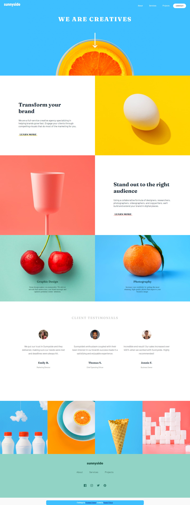
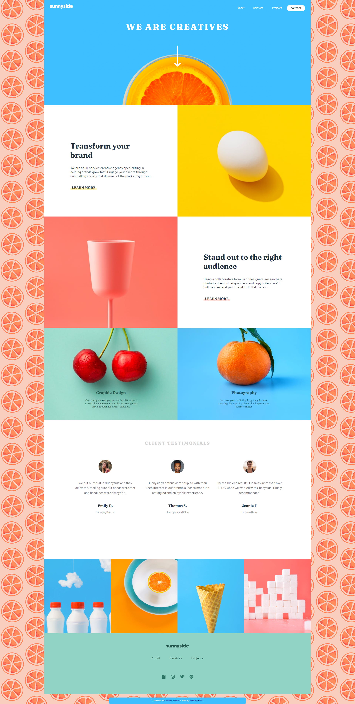
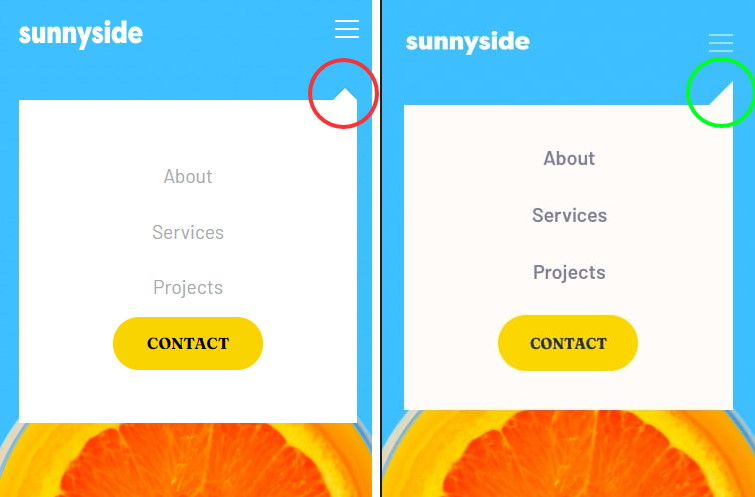

# Frontend Mentor - Sunnyside agency landing page solution

This is a solution to the [Sunnyside agency landing page challenge on Frontend Mentor](https://www.frontendmentor.io/challenges/sunnyside-agency-landing-page-7yVs3B6ef). Frontend Mentor challenges help you improve your coding skills by building realistic projects.

## Table of contents

- [Overview](#overview)
  - [The challenge](#the-challenge)
  - [Screenshot](#screenshot)
  - [Links](#links)
- [My process](#my-process)
  - [Built with](#built-with)
  - [What I learned](#what-i-learned)
  - [Continued development](#continued-development)
  - [Useful resources](#useful-resources)
- [Author](#author)
- [Acknowledgments](#acknowledgments)

## Overview

### The challenge

Users should be able to:

- View the optimal layout for the site depending on their device's screen size
- See hover states for all interactive elements on the page

### Screenshot

| Desktop Final Design | Desktop Alternate Design |
| --- | --- |
|||

### Links

- Solution URL: [Add solution URL here](https://your-solution-url.com)
- Live Site URL: [Hosted on Github Pages](#)

## My process

### Built with

- HTML markup
- Sass
- Flexbox
- CSS Grid
- JavaScript

### What I learned

During this project I was able to gain more experience using CSS Grid and creating a mobile menu. My design process was as follows.

1) I started with the desktop design starting with the header section and working down to the footer. During this step I focussed on hard coding many of the spacing values using pixels (converted to rem using a Sass function). At this point I used Chrome in dev tools to set the screen size to 1440px.

2) I did not house the entire design inside of a mega grid. Instead I used grids to layout certain sections. The three major grids were the 6 celled one directly beneath the header section, the client testimonials section, and the pseudo image gallery near the bottom.

3) After getting the desktop design and the hover effects to near completion I began working on the smallest mobile screen design (375px). I followed a similar pattern as the desktop design in that many of the margins/paddings/etc were hard coded to values in order to get the design as close to the design image specs as possible.

4) I created the mobile menu by changing the navbar's “UL” CSS. At smaller screen sizes I would have the navbar list items hidden by default and would add a class to it via JavaScript in order to make it appear.

5) I began to work on the responsive CSS for tablets. It was here that I saw that I had issues when resizing my window to "in between screen" sizes. Since much of my spacing was hard coded I would get sporadic layouts. A prime example was within the "Graphic Design" and "Photography" cells. On certain screen sizes the text would be squeezed together and would cover the background images when it should be staying beneath the image.

6) I updated the spacing CSS using more percentage values instead of hard coded values. This resulted in a more consistent look spanning multiple screen sizes.


Something I found cool)
It took me a bit of time to find the best way to get the social media icons to change to white on the hover event. This was mainly because I loaded the SVG files in an IMG tag. After a little bit of research and tinkering I stumbled across this elegant solution.

```css
.footer-social-media li:hover {    
    filter: brightness(0) invert(1);    
}
```

### Continued development

During this project I fell back into the habit of starting with the desktop design first instead of mobile first design. I feel that as I continue to get more proficient with CSS Grid, I’ll be able to return to mobile first design principles in the context of CSS Grid. I would also like to become more proficient in CSS Grid in general.

Another area I would like to investigate in the future is a more efficient use of media queries and the use of landscape and portrait design rules. Finally, in regards to designing for multiple screen sizes, I was able to get the designs to look acceptable at hard coded screen widths with the help of Chrome Dev Tools but when I would manually reduce the screen width the rules would not apply as I expected. It would be nice to have better control over my designs when users manually reduce the size of their browser window. I'm not sure if it can be done with CSS alone or if I need to introduce some JavaScript. Either way I will be attempting to tackle this issue in future projects.

The final concept I would like to improve on is the “mobile nav menu” top-right corner leaflet (the part that makes the menu look similar to a speech bubble). I struggled with this and had to look up many examples on the best way to approach this. I got an approximation of it but still feel my knowledge on the technique is shaky. To add to that I plan to do further investigating on rules such as "::before" in order to add them to my belt of intuition. The screen shot comparison is below. My design is on the right while the target design is on the  left.

<p align="center">
 
</p>

### Useful resources

- [Change icon image color on hover](https://stackoverflow.com/questions/22252472/how-to-change-the-color-of-an-svg-element) - This gave me some ways to change the color of the SVG files. One of the interesting techniques was to use the "filter" CSS rule.
- [Changing Color of SVG Paths](https://css-tricks.com/using-svg/) - Provided some useful ways to change the color of an SVG image.
- [Hover over element and effect another element's CSS rule](https://stackoverflow.com/questions/6910049/on-a-css-hover-event-can-i-change-another-divs-styling) - Used to create the underline hover effect under the "Learn More" text.
- [Create Table in Github Read Me](https://docs.github.com/en/github/writing-on-github/working-with-advanced-formatting/organizing-information-with-tables) - I used this in order to create the tabled images in this ReadMe file.

## Author

- Frontend Mentor - [@shangum](https://www.frontendmentor.io/profile/shangum)

## Acknowledgments

Shout out to [Brian Design's tutorial](https://www.youtube.com/watch?v=yFWAOzwovrQ) for inspiration and direction on creating the mobile window. Hats off to him!

For my alternate desktop design I used some repeating oranges from this pattern library. [The Pattern Library](http://thepatternlibrary.com/)

